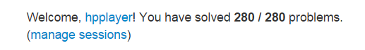
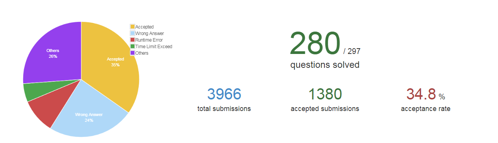

# LeetCode-Round2

LeetCode Round2 !
In this repo I will only add problems that I think need more practices!

<b>Update:</b>

I finished round2 on Oct.27 2015

38 days and 280/280 algorithm problems

<b>Screenshot 1:</b>

<b>Screenshot 2(error rate):</b>

(note: 297 is number of the total problems including shell and SQL problems)

